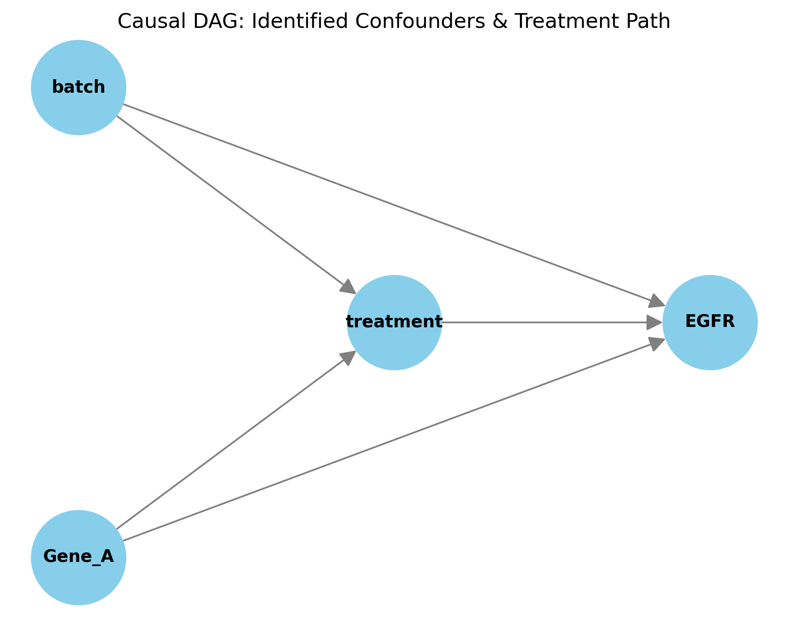
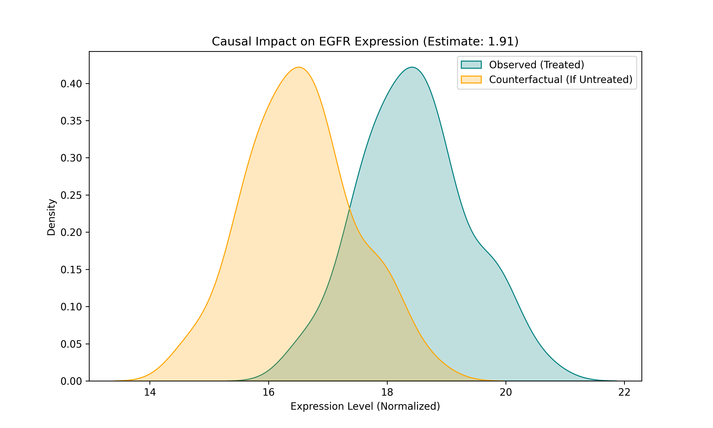

# Counterfactual Gene Expression Analysis with CausalPy & DoWhy

## Project Overview
This project addresses a critical gap in transcriptomic analysis: distinguishing between correlation and causation. While standard differential expression (DE) can identify genes that change in response to a drug, it often picks up noise from batch effects or secondary biological processes[cite: 5]. 

Using a causal inference framework, we ask the counterfactual question: "What would the EGFR expression in these specific treated samples have been if they had not received the treatment?"[cite: 3]

## Key Visualizations

### 1. Causal Directed Acyclic Graph (DAG)

The DAG represents our structural assumptions, explicitly modeling **batch** and **Gene_A** as confounders to isolate the true treatment effect[cite: 4, 5].

### 2. Counterfactual Impact Distribution

The shift between the peaks quantifies the ~1.91 units of expression directly attributable to the drug treatment, rather than noise[cite: 3, 5].

## Robustness Testing
The model passed the **Placebo Treatment Refutation** (p-value: 1.0), confirming the original estimate is robust and not due to random chance[cite: 4].

## Tech Stack
- **DoWhy**: Causal identification and refutation[cite: 4, 6].
- **CausalPy / PyMC**: Bayesian counterfactual estimation[cite: 3, 6].
- **Seaborn**: Data visualization[cite: 6].
- **GitHub Actions**: Continuous Integration.
